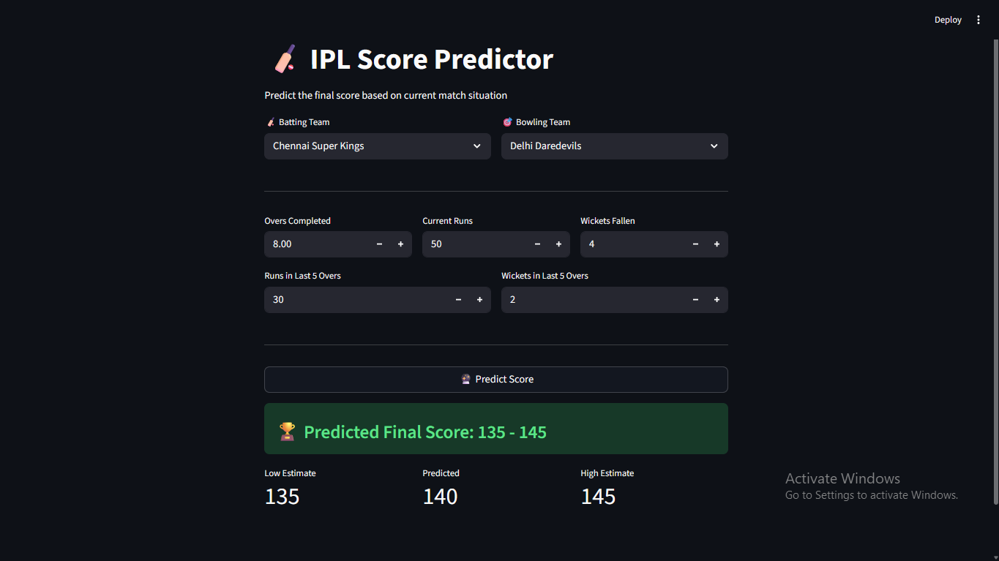
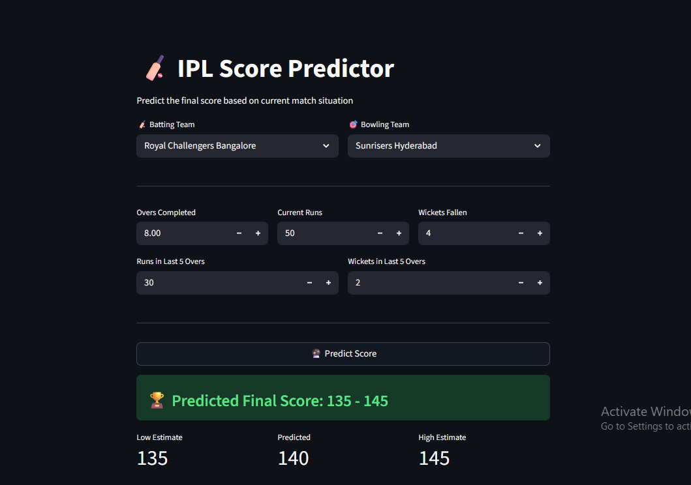

# 🏏 IPL Score Predictor

A machine learning web app built with **Streamlit** that predicts the final IPL match score based on the current match situation using a trained Random Forest model.


---

## 🚀 Live Demo

[](https://your-app-url.streamlit.app)

<p align="center">
  <a href="https://ipl-score-prediction-roshan.streamlit.app/">
    
  </a>
</p>


---

## 📸 Screenshot




---

## 📌 Features


- Predicts final score based on live match data
- Supports all 8 major IPL teams
- Clean and interactive UI built with Streamlit
- Score prediction range (low / predicted / high)

---

## 🧠 Model

- **Algorithm:** Random Forest Regressor
- **Input Features:**
  - Batting Team (one-hot encoded)
  - Bowling Team (one-hot encoded)
  - Overs completed
  - Current runs
  - Wickets fallen
  - Runs scored in last 5 overs
  - Wickets fallen in last 5 overs
- **Output:** Predicted final score

---

## 🏟️ Supported Teams


| Team |
|------|
| Chennai Super Kings |
| Delhi Daredevils |
| Kings XI Punjab |
| Kolkata Knight Riders |
| Mumbai Indians |
| Rajasthan Royals |
| Royal Challengers Bangalore |
| Sunrisers Hyderabad |

---

## 🗂️ Project Structure

```
IPL-Score-Predictor/
├── app.py                  # Streamlit app
├── flight_rf.pkl           # Trained ML model (via Git LFS or HuggingFace)
├── requirements.txt        # Python dependencies
└── README.md
```

---

## ⚙️ Installation & Setup

### 1. Clone the repository
```bash
git clone https://github.com/roshanchourasia001/FlightPrice_Prediction.git
cd FlightPrice_Prediction
```

### 2. Install dependencies
```bash
pip install -r requirements.txt
```

### 3. Run the app
```bash
streamlit run streamit_app.py
```

---

## 📦 Requirements

```
streamlit
numpy
scikit-learn
```

Install all with:
```bash
pip install -r requirements.txt
```

---

## ☁️ Deployment


### Deploy on Streamlit Cloud (Free)
1. Push your code to GitHub
2. Go to [https://streamlit.io/cloud](https://streamlit.io/cloud)
3. Connect your GitHub repo
4. Set `streamlit_app.py` as the entry point
5. Click **Deploy**

> **Note:** If your model file is large (>100MB), host it on [Hugging Face Hub](https://huggingface.co/) and load it dynamically:
> ```python
> from huggingface_hub import hf_hub_download
> model_path = hf_hub_download(repo_id="your-username/your-model", filename="model.pkl")
> ```

---

## 🤝 Contributing

Pull requests are welcome! For major changes, please open an issue first.


---

## 🙋‍♂️ Author

**Roshan Chourasia**


- GitHub: [@roshanchourasia001](https://github.com/roshanchourasia001)
- linkedin: [linkedin](https://linkedin.com/roshan-chourasia-122a8b252)

---

## 📄 License

This project is open-source and available under the [MIT License](LICENSE).

---

## ⭐ Support & Stay Connected

If this project helped you or you found it interesting, consider giving it a **star** ⭐ — it takes just a second but means a lot!

> _"A star is a small click for you, but a big motivation for me."_

I'm constantly building more projects like this — from Machine Learning to Full-Stack Web Apps.  
**Follow me on GitHub** to stay updated and never miss what's coming next! 🚀

[](https://github.com/roshanchourasia001)
[](https://github.com/roshanchourasia001/FlightPrice_Prediction)
